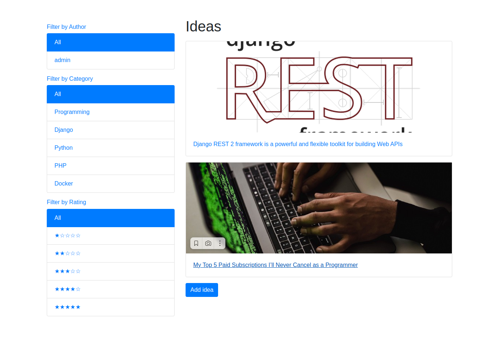
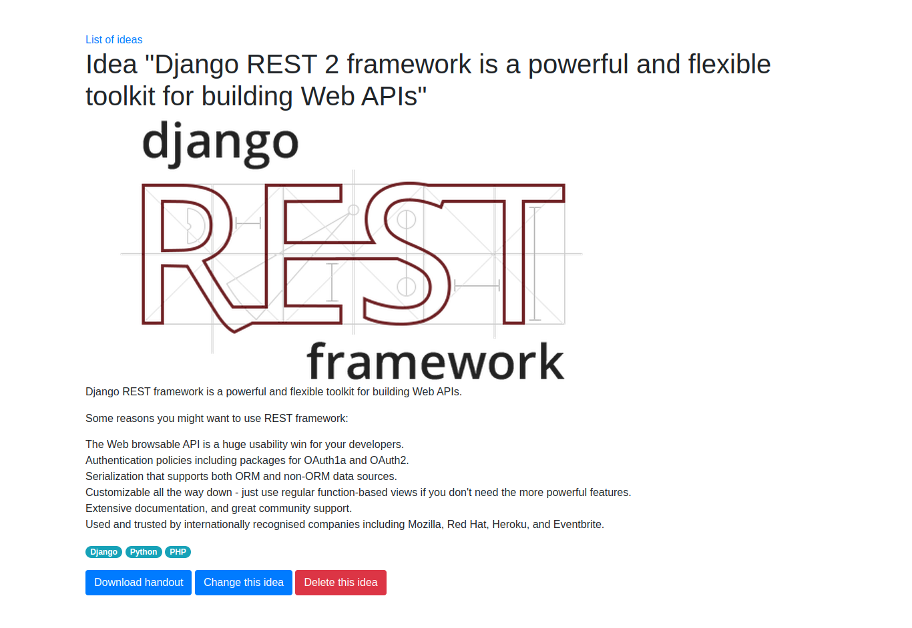
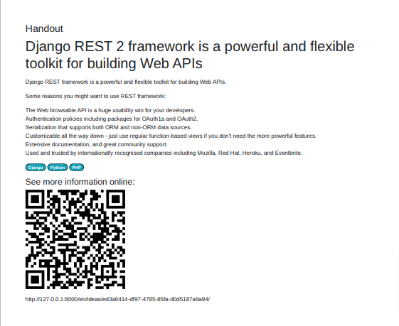
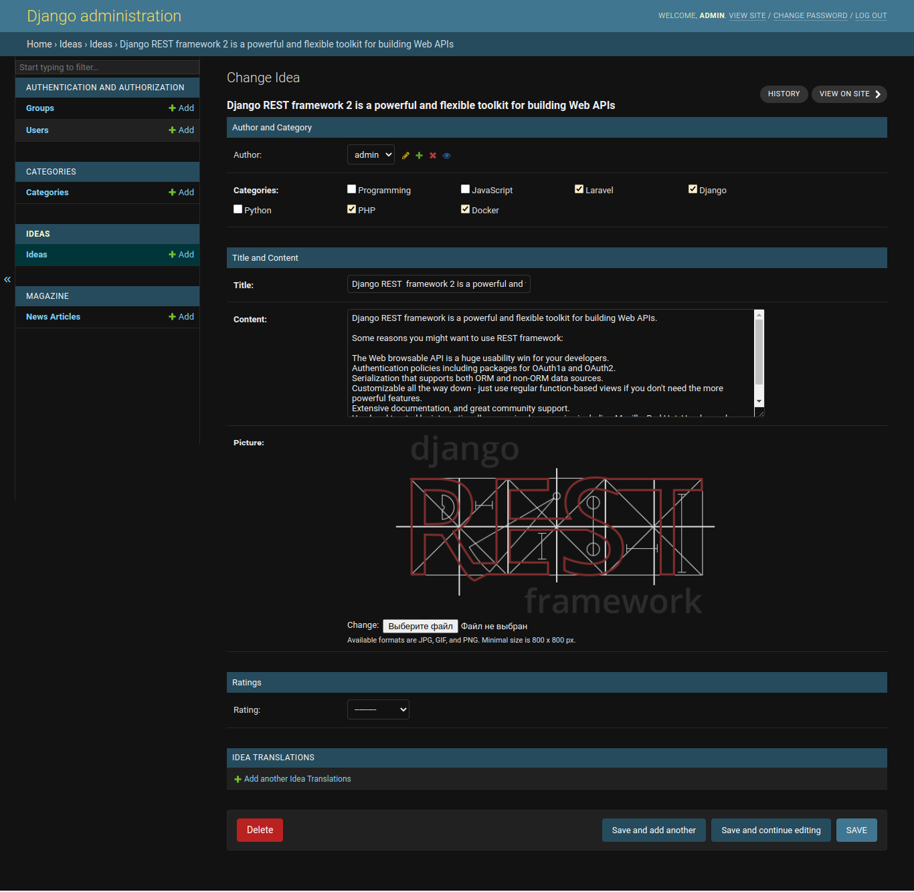

## In this chapter, we will cover the following topics:

- Creating an app with CRUDL functions ✅
- Saving the author of a model instance ✅
- Uploading images ✅
- Creating a form layout with custom templates ✅
- Creating a form layout with django-crispy-forms ✅
- Working with formsets ✅
- Filtering object lists ✅
- Managing paginated lists ✅
- Composing class-based views ✅
- Providing Open Graph and Twitter Card data ✅
- Providing schema.org vocabularies ✅
- Generating PDF documents ✅
- Implementing a multilingual search with Haystack and Whoosh ✅
- Implementing a multilingual search with Elasticsearch DSL ❓

---

### Idea List

---

### Detail page

---

### Page to pdf with qr code

---

### Admin panel

