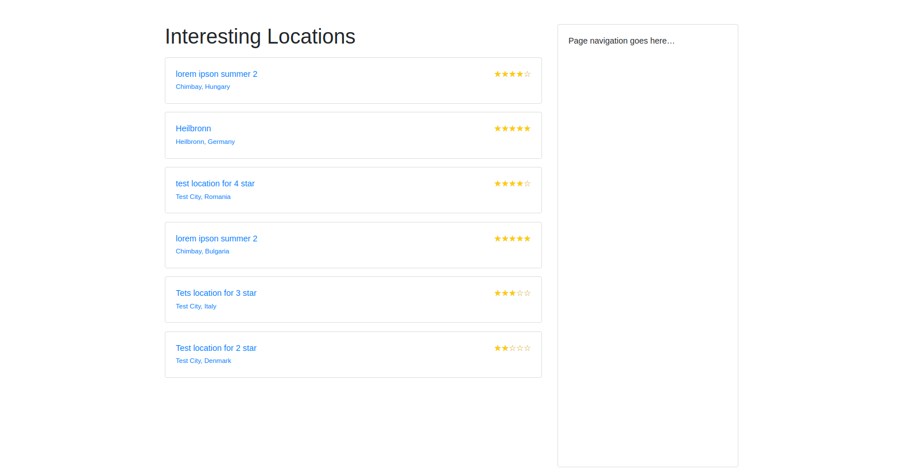
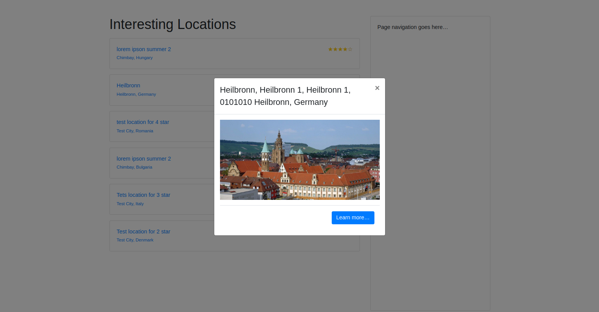
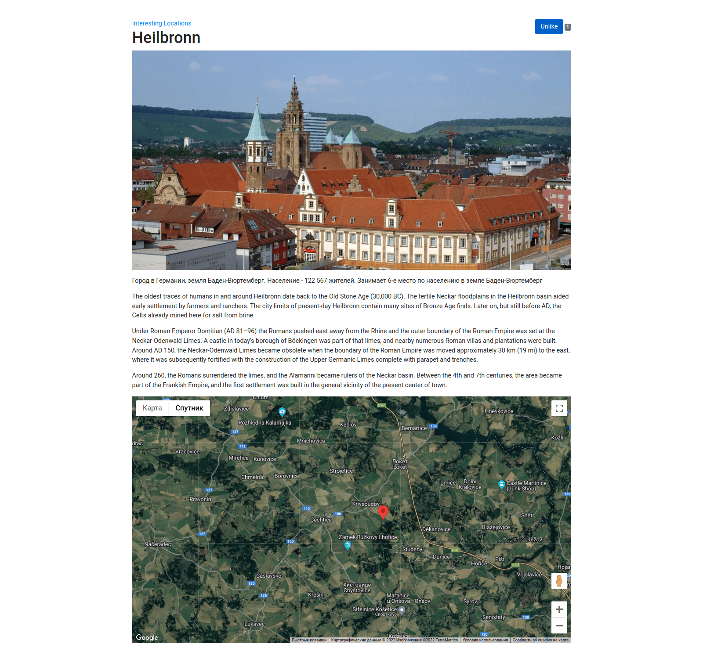
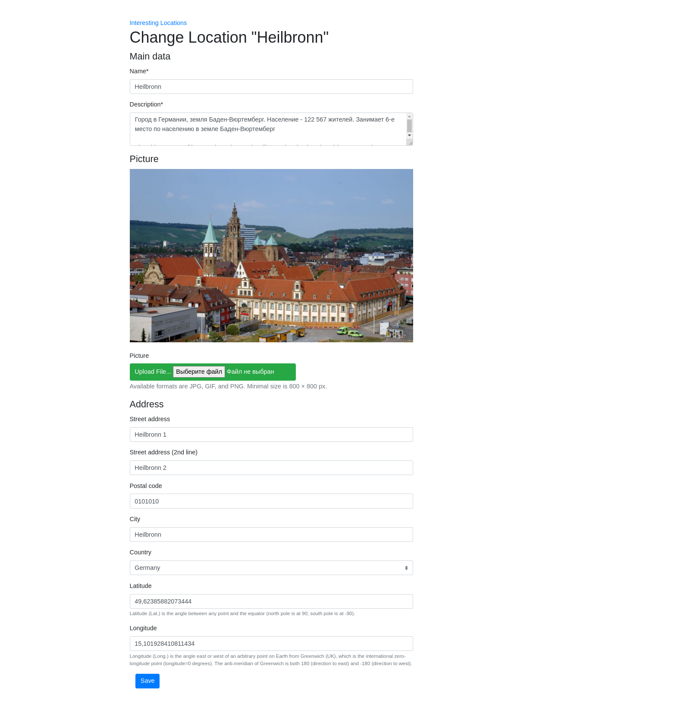
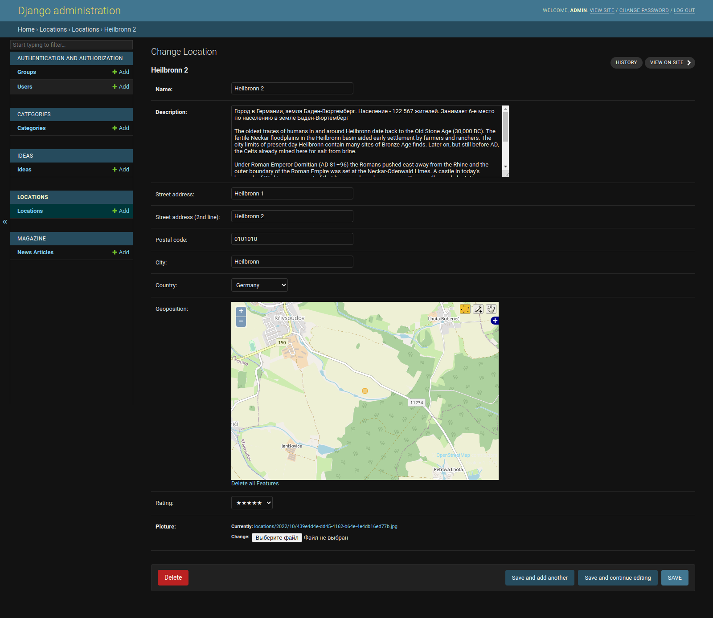

## In this chapter, we will cover the following topics:

- Arranging the base.html template ✅
- Using Django Sekizai ✅
- Exposing settings in JavaScript ✅
- Using HTML5 data attributes ✅
- Providing responsive images(env)$ python manage.py migrate ideas zero ✅
- Implementing a continuous scrolling ✅
- Opening object details in a modal dialog ✅
- Implementing the Like widget ✅
- Uploading images via Ajax ✅

---

### Demo

---

### Location List

---

### Location modal dialog

---

### Location detail page

---

### Location change page

---
### Admin panel

