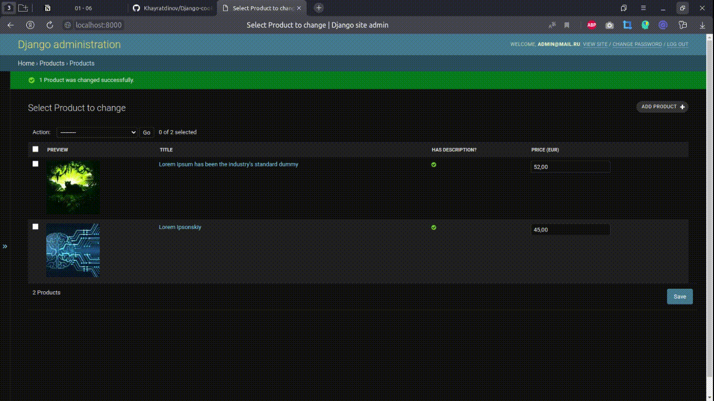
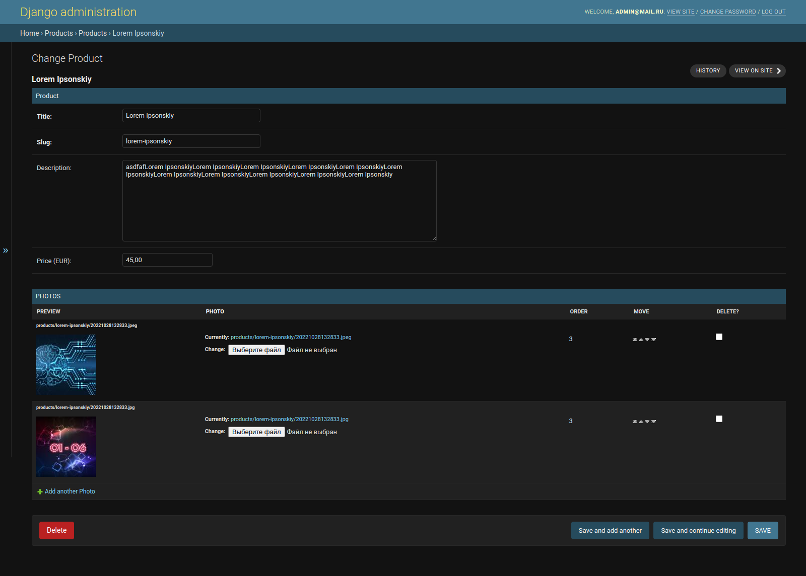
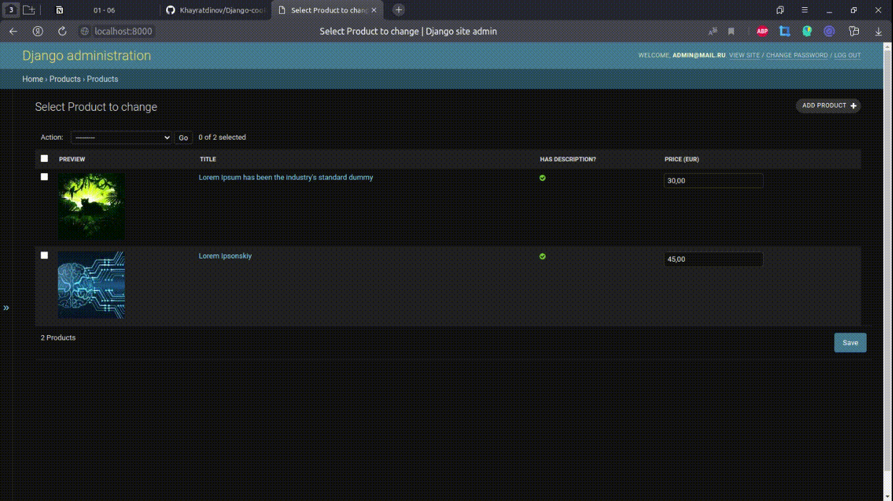
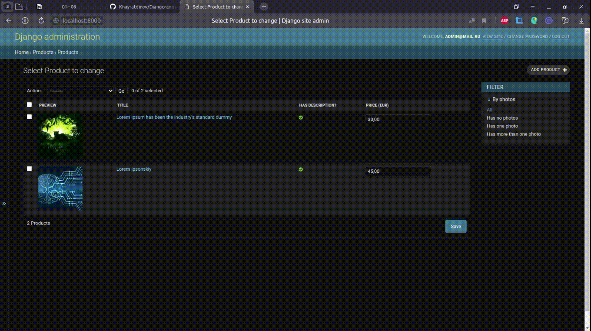
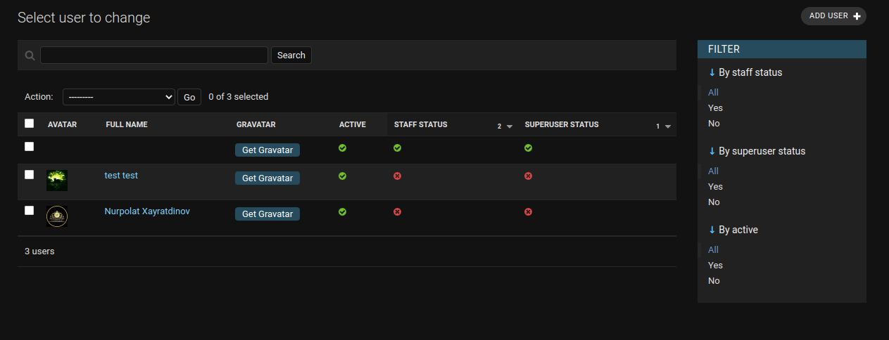
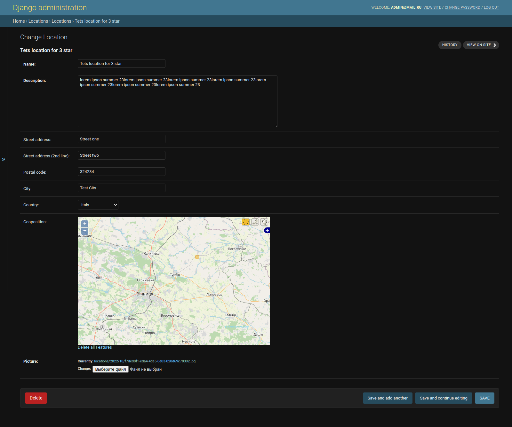

## In this chapter, we will cover the following topics:

- Customizing columns on the change list page ✅
- Creating sortable inlines ✅
- Creating admin actions ✅
- Developing change list filters ✅
- Changing the app label of a third-party app ✅
- Creating a custom accounts app ✅
- Getting user Gravatars ✅
- Inserting a map into a change form ✅

## Customizing columns on the change list page

---

## Creating sortable inlines

---

## Creating admin actions export object to .xlsx

---

## Developing change list filters

---

## Creating a custom accounts app and Getting user Gravatars

---

## Inserting a map into a change form

---
